# Solar Ray Direction: Coordinate Systems and Angle Conventions

Alejandro Morales

Centre for Crop Systems Analysis - Wageningen University

Note: This document was created in collaboration with Claude Code

## Overview

The function `rotate_coordinates` computes a local coordinate system whose Z axis
points in the direction of incoming solar radiation, expressed in the coordinate
frame of the 3D scene. You normally do not call this function directly but whenever
you create a directional light source from azimuth and zenith angles (e.g., when 
creating the light sources in the sky from `SkyDomes.jl`, this function is called
internally).

Five angles fully describe the geometry:

| Symbol | Name | 
|--------|------|
| θ | Solar zenith angle | 
| Φ | Solar azimuth angle | 
| α | Azimuth of scene X axis | 
| `alpha_soil` | Slope inclination | 
| `beta_soil` | Azimuth of slope normal | 

All five are **geocentric angles** — defined with respect to a fixed horizontal
reference frame on the Earth's surface. The scene can be tilted and rotated freely;
the solar angles are always measured the same way.

---

## The Three Coordinate Systems

### 1. Geocentric Coordinate System (GCS)

The fixed reference frame. All input angles are defined in this system.

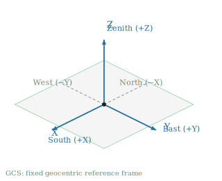

| Axis | Direction | Notes |
|------|-----------|-------|
| +X | South | Geographic south |
| +Y | East | Geographic east |
| +Z | Zenith | Away from Earth's centre |

The GCS is never used directly by the ray tracer — it is only the frame in which
the input angles are specified.

---

### 2. Scene Coordinate System (SCS)

The coordinate frame of the 3D mesh (`PGP.X`, `PGP.Y`, `PGP.Z`). This is what
the user builds their geometry in.

**For a flat, default-oriented scene** (α = π, `alpha_soil` = 0) the SCS and GCS
coincide. **When α ≠ π** the X axis is rotated to a different compass bearing, for
example to simulate East–West crop rows (right panel):

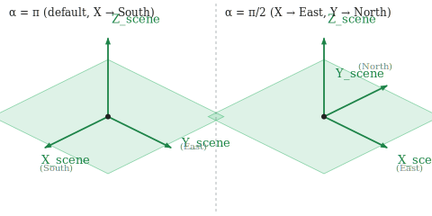

**When `alpha_soil` > 0** the entire XY plane is tilted relative to horizontal,
representing a slope. The Z axis of the SCS is then the outward normal to the
slope surface, no longer aligned with the geocentric zenith:

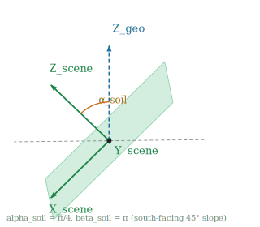

---

### 3. Local Coordinate System (LCS)

The output of `rotate_coordinates`. Defines the solar illumination geometry.

```
  (x, y, z) = rotate_coordinates(θ, Φ, α, alpha_soil, beta_soil)
```

| LCS axis | Meaning |
|----------|---------|
| `z` | Direction of solar rays (from sun toward scene), expressed in SCS |
| `x`, `y` | Span the plane perpendicular to `z` (used for Lambertian hemisphere sampling) |

Only the `z` component is used by `FixedSource`. All three axes are used by
`LambertianSource` to sample random directions within a hemisphere via
`polar_to_cartesian`.

The three axes always form a right-handed orthonormal basis.

---

## Angle Reference

### Solar Zenith Angle θ

Angle between the sun and the geocentric vertical (Z_geo). Zero when the sun is
directly overhead (of a flat surface); π/2 at sunrise and sunset.

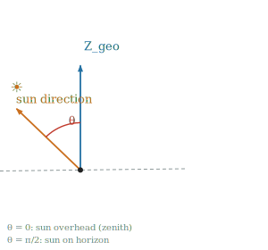

| θ | Sun position |
|---|-------------|
| 0 | Directly overhead |
| π/6 | 60° elevation |
| π/4 | 45° elevation |
| π/3 | 30° elevation |
| π/2 | On the horizon |

---

### Solar Azimuth Angle Φ

Horizontal compass direction of the sun, measured **clockwise from North** when
viewed from above.

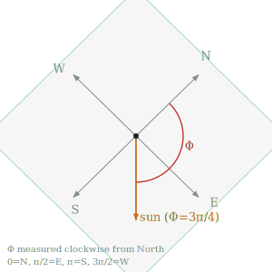

| Φ | Sun is in the direction of |
|---|---------------------------|
| 0 | North |
| π/2 | East |
| π | South |
| 3π/2 | West |

A sun at (θ, Φ) = (π/2, 0) sits on the northern horizon; rays travel
horizontally toward the South (+X in GCS).

---

### Scene X-Axis Azimuth α

Geocentric azimuth of the scene's X axis. Controls the orientation of the crop
rows relative to the compass. α is always the azimuth of the **projection of
X_scene onto the horizontal GCS plane**.

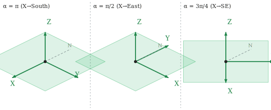

For a flat surface, Y_scene has azimuth α − π/2 (90° counterclockwise from X
when viewed from above, right-hand rule with Z up).

| α | X_scene | Y_scene | Typical use |
|---|---------|---------|-------------|
| π | South | East | North–South rows (default) |
| π/2 | East | North | East–West rows |
| 0 | North | West | North–South rows (reversed) |
| 3π/4 | Southeast | Northeast | Diagonal rows |

---

### Slope Inclination `alpha_soil`

Angle between Z_scene (the slope's outward normal) and Z_geo (the geocentric
vertical). Equivalently, the dip angle of the surface from horizontal.

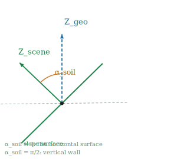

| `alpha_soil` | Surface |
|--------------|---------|
| 0 | Flat horizontal (default) |
| π/6 | Gentle slope (~17°) |
| π/4 | Moderate slope (45°) |
| π/3 | Steep slope (~60°) |
| π/2 | Vertical wall |

When `alpha_soil` = 0 the result is identical to the flat-surface case and
`beta_soil` has no effect.

---

### Slope Orientation `beta_soil`

Geocentric azimuth of the slope's outward normal (Z_scene) projected onto the
horizontal plane. This is the compass direction the slope **faces** (a ball placed
on the slope rolls in the opposite direction).

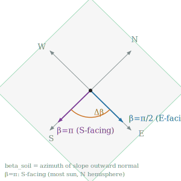

| `beta_soil` | Slope faces | Notes |
|-------------|-------------|-------|
| π | South (default) | Most sunlit in northern hemisphere |
| 0 | North | Least sunlit in northern hemisphere |
| π/2 | East | Morning sun |
| 3π/2 | West | Afternoon sun |

---

## Scenario Diagrams

### Scenario A: Flat surface, sun at arbitrary (θ, Φ)

The standard case. The LCS z-axis (solar ray direction in SCS) is:

```
  z_ray = [ sin θ cos Φ,  −sin θ sin Φ,  −cos θ ]   (for α = π)
```

Side view when Φ = π (sun from South), looking from East:

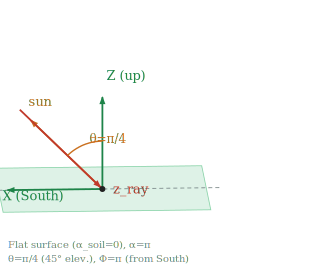

Top-down views for the four cardinal horizon directions (θ = π/2):

```
  North horizon (Φ=0)        East horizon (Φ=π/2)
  ray → (1, 0, 0)            ray → (0, −1, 0)

       N                          N
       ↓ ← ray travels S          │
  W ───┼─── E              W ←────┼─── E
       │                          │ ← ray travels W (–Y)
       S                          S

  South horizon (Φ=π)        West horizon (Φ=3π/2)
  ray → (−1, 0, 0)           ray → (0, 1, 0)

       N                          N
       ↑ ← ray travels N          │
  W ───┼─── E              W ─────┼──→ E
       │                          │ ← ray travels E (+Y)
       S                          S
```

---

### Scenario B: Flat surface, rows oriented East–West (α = π/2)

The SCS is rotated so that X points East and Y points North. The same sun
produces a different LCS z-axis when expressed in this rotated frame.

Example: sun on the North horizon (θ = π/2, Φ = 0).

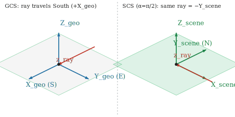

In GCS the ray goes South (+X_geo). In the α = π/2 SCS, South = −Y_scene, so the
ray is `(0, −1, 0)` in SCS coordinates.

---

### Scenario C: South-facing slope (beta_soil = π, alpha_soil = π/4)

The slope descends toward the South. The outward normal Z_scene is tilted 45°
from vertical toward South (+X_geo direction).

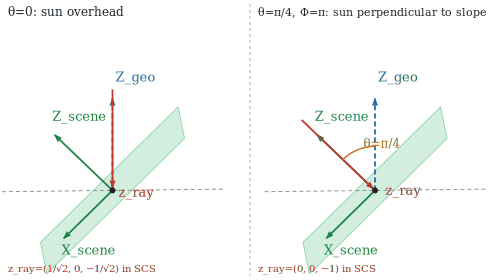

**Sun overhead (θ = 0):** the geocentric ray is (0, 0, −1). In the tilted SCS it
has equal South (+X_scene) and downward (−Z_scene) components.

```
  z_ray = (1/√2,  0,  −1/√2)
           ↑           ↑
       +X_scene    −Z_scene
     (down slope)  (into surface)
```

Viewed along the slope, the overhead sun hits at 45° from the slope normal — equal
to the slope inclination itself.

**Sun directly facing the slope (θ = π/4, Φ = π):** the geocentric ray aligns
with the inward slope normal. The sun illuminates the slope perpendicularly.

```
  z_ray = (0, 0, −1)   ← straight into the slope normal
```

This case is the right-hand panel of the figure above.

**Sun on the East horizon (θ = π/2, Φ = π/2):** the East direction is
perpendicular to the North–South tilt axis. The slope tilt has no effect.

```
  z_ray = (0, −1, 0)   ← same as for a flat surface
```

---

### Scenario D: North-facing slope (beta_soil = 0, alpha_soil = π/4)

The slope descends toward the North. The outward normal Z_scene tilts 45° toward
North (−X_geo direction).

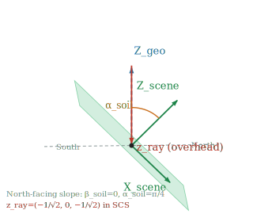

**Sun overhead (θ = 0):**

```
  z_ray = (−1/√2,  0,  −1/√2)
            ↑           ↑
        −X_scene    −Z_scene
     (down the slope, (into surface)
      toward North)
```

The overhead sun hits the North-facing slope from the South side of the slope
normal — opposite to Scenario C.

---

## The Rotation Sequence

```julia
rot = RotZ(α − beta_soil) ∘ RotY(−alpha_soil) ∘ RotZ(beta_soil − π − Φ) ∘ RotY(−θ)
result = (x = .−rot(X), y = .−rot(Y), z = .−rot(Z))
```

The four elementary rotations are applied **right to left** (innermost first):

```
  Starting vector: [0, 0, 1]  (geocentric zenith)
        │
        ▼
  Step 1 — RotY(−θ)
        Tilt toward North (−X) by the solar zenith angle.
        Result: [−sin θ, 0, cos θ]
        │
        ▼
  Step 2 — RotZ(beta_soil − π − Φ)
        Rotate around Z combining the solar azimuth (−Φ term) with the
        slope orientation (beta_soil − π term). For a flat default surface
        this is simply RotZ(−Φ).
        │
        ▼
  Step 3 — RotY(−alpha_soil)
        Tilt by the slope inclination. Identity when alpha_soil = 0.
        │
        ▼
  Step 4 — RotZ(α − beta_soil)
        Rotate within the slope plane to put the X axis at geocentric azimuth α.
        Identity when α = beta_soil.
        │
        ▼
  Negate all three components → solar ray direction (from sun toward scene)
```

### Simplifications

| Condition | Simplified formula |
|-----------|-------------------|
| Flat surface (`alpha_soil` = 0) | `RotZ(α − π − Φ) ∘ RotY(−θ)` |
| Flat + default orientation (α = π) | `RotZ(−Φ) ∘ RotY(−θ)` |

### Analytical form for flat surfaces

For `alpha_soil` = 0, the solar ray direction in SCS has a closed form:

```
  z_ray = [ −sin θ cos(Φ − α),   sin θ sin(Φ − α),   −cos θ ]
```

For the default α = π this simplifies to:

```
  z_ray = [ sin θ cos Φ,   −sin θ sin Φ,   −cos θ ]
```

---

## Reference Tables

### Flat surface, default orientation (α = π, `alpha_soil` = 0)

| θ | Φ | z_ray in SCS | Physical meaning |
|---|---|--------------|-----------------|
| 0 | any | (0, 0, −1) | Overhead sun, rays straight down |
| π/2 | 0 | (1, 0, 0) | North horizon → rays toward South |
| π/2 | π/2 | (0, −1, 0) | East horizon → rays toward West |
| π/2 | π | (−1, 0, 0) | South horizon → rays toward North |
| π/2 | 3π/2 | (0, 1, 0) | West horizon → rays toward East |
| π/4 | π | (−1/√2, 0, −1/√2) | 45° elevation from South |

### South-facing 45° slope (α = π, `alpha_soil` = π/4, `beta_soil` = π)

| θ | Φ | z_ray in SCS | Physical meaning |
|---|---|--------------|-----------------|
| 0 | any | (1/√2, 0, −1/√2) | Overhead sun, 45° from slope normal |
| π/4 | π | (0, 0, −1) | Sun perpendicular to slope surface |
| π/2 | 0 | (1/√2, 0, 1/√2) | North horizon → hits back face of slope |
| π/2 | π/2 | (0, −1, 0) | East horizon → same as flat |

### Effect of α on a south-facing 45° slope (`alpha_soil` = π/4, `beta_soil` = π)

| θ | Φ | α | z_ray in SCS | Notes |
|---|---|---|--------------|-------|
| 0 | any | π | (1/√2, 0, −1/√2) | X points South |
| 0 | any | π/2 | (0, −1/√2, −1/√2) | X points East |

---

## Common Pitfalls

**`alpha_soil` = 0 makes `beta_soil` irrelevant.**
When the surface is flat the tilt step (Step 3) is the identity and Step 4
cancels with the extra offset in Step 2. `beta_soil` can be set to anything.

**z_ray with a positive Z component.**
A positive Z component means the solar ray is striking the *back face* of the
slope (the sun is below the slope's local horizon). This means direct solar radiation
will not reach the crops (but part of the diffuse solar radiation will).

**α is a geocentric azimuth, not an in-slope-plane angle.**
Even on a tilted surface, α is the azimuth of X_scene projected onto the
horizontal GCS plane — not an angle measured within the slope. Two slopes with
different inclinations but the same α will have their X axes projecting to the
same compass direction.

**Solar azimuth convention.**
Φ = 0 is geographic **North** (not East as in some meteorological conventions).
The azimuth increases clockwise when viewed from above.
